# This week's reading

---

<!-- ## Minimum wages in Taiwan -->

{.r-stretch}

::: aside
Source: https://udn.com/news/story/7238/9749644
:::

---

<!-- ## Low wage workers? -->

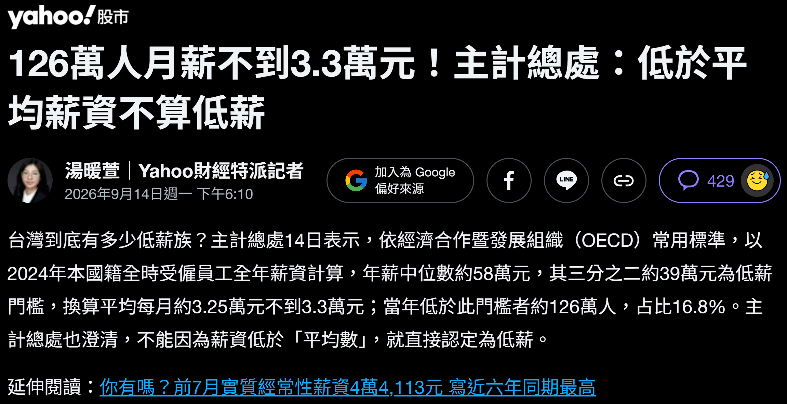{fig-align="center"}

---

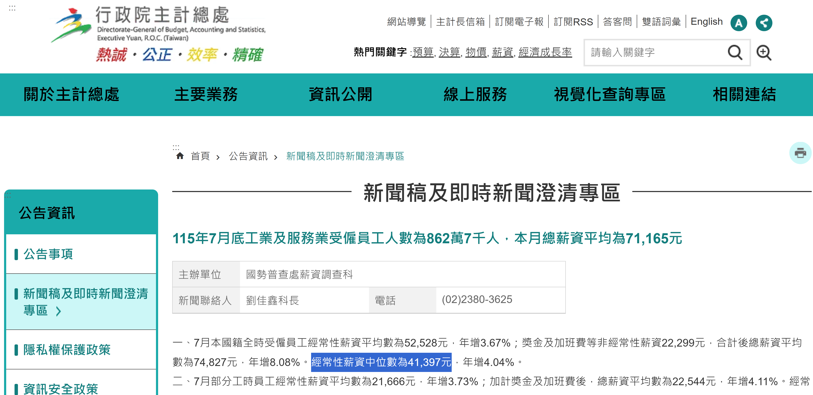{fig-align="center"}

::: aside
Source: https://www.dgbas.gov.tw/News_Content.aspx?n=3602&s=236702
:::

---

## Transferable Skills across the Disciplines

::: {.incremental}
- Transfer knowledge to new contexts
- See the connections among reading, writing, and disciplinarity
:::

## Deciphering the Conversation

::: {.incremental}
> imagine the author not as sitting alone in an empty room hunched over a desk or staring at a screen but as sitting in a crowded coffee shop talking to and engaging with others who are making claims.

In other words,

> imagine an ongoing, multisided conversation in which all participants (including the author) are trying to persuade others to agree or at least to take their positions seriously.
:::

## Reading for the Conversation

Figure out

- what views the author is responding to
- what the author's own argument is

::: aside
*Graff, Gerald, and Cathy Birkenstein. 2021. "They Say / I Say": The Moves That Matter in Academic Writing.* (Page 189)
:::

## Is it clear in this table

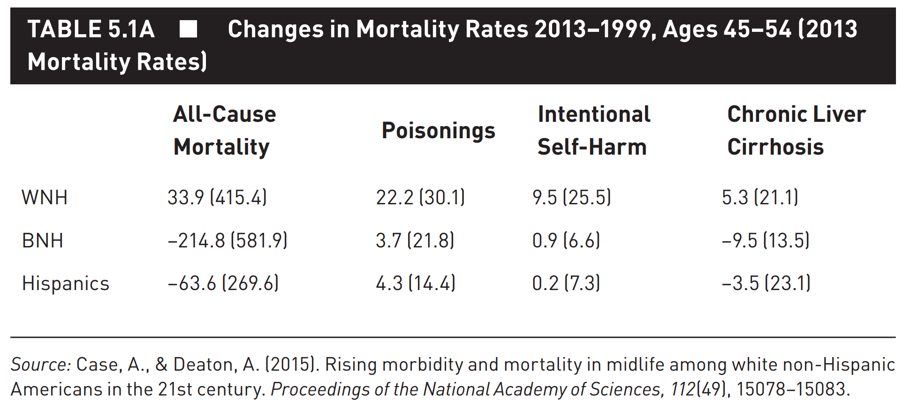{.r-stretch}

- [ ] who
- [ ] what
- [ ] when
- [ ] where
- [ ] how

::: aside
Pennock, Andrew. 2023. *The CQ Press Writing Guide for Public Policy.* (Chapter 5)
:::

## With some simple fixes

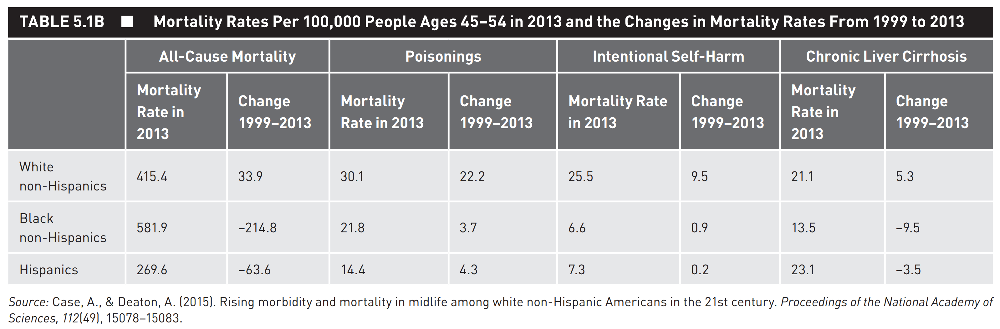{.r-stretch}

- [x] WNH, BNH
- [ ] why

::: aside
Pennock, Andrew. 2023. *The CQ Press Writing Guide for Public Policy.* (Chapter 5)
:::

## Improvements

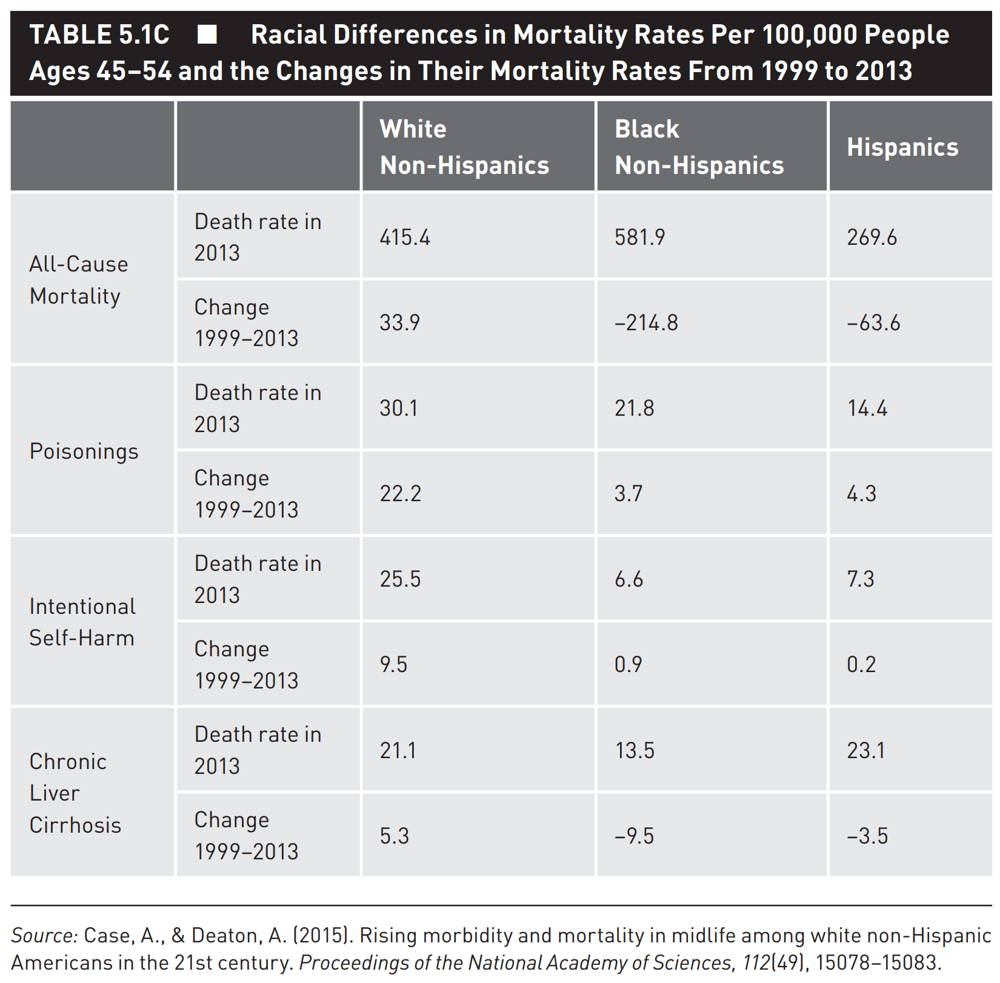{.r-stretch}

- [x] key point
- [x] what's being compared

::: aside
Pennock, Andrew. 2023. *The CQ Press Writing Guide for Public Policy.* (Chapter 5)
:::

## Writing about a Table (1/3) {.smaller}

> As shown in Table 5.1c, the all-cause mortality rate of WNHs ages 45–54 is currently 415.4, BNHs is 589.1, and Hispanics is 269.6. These rates have changed for WNHs by 33.9, –214.8 for BNHs, and –63.6 for Hispanics. The poisoning rate of WNHs in this age group is 30.1, BNHs is 21.8, and Hispanics is 14.4. These rates have changed for WNHs by 22.2, 3.7 for BNHs, and 4.3 for Hispanics. The intentional self-harm rate of WNHs in this age group is 25.5, BNHs is 6.6, and Hispanics is 7.3. These rates have changed for WNHs by 9.5, 0.9 for BNHs, and 0.2 for Hispanics. The chronic liver cirrhosis rate of WNHs in this age group is 25.5, BNHs is 6.6, and Hispanics is 7.3. These rates have changed for WNHs by 9.5, 0.9 for BNHs, and 0.2 for Hispanics.

## Writing about a Table (2/3) {.smaller}

> As shown in Table 5.1c, over the 15-year period between 1999 and 2015, midlife all-cause mortality fell by more than 200 per 100,000 for black non-Hispanics (BNHs), and by more than 60 per 100,000 for Hispanics. By contrast, white non-Hispanic (WNH) mortality rose by 34 per 100,000. Deaths from poisonings roughly tripled across the time period for WNHs while slightly increasing for other groups. Intentional self-harm mortality also increased for WNHs by 9.5 per 100,000 while BNH mortality increased by 0.9 per 100,000 and Hispanics by 0.2 per 100,000. Finally, the chronic liver cirrhosis mortality rate of WNHs increased by 5.3 per 100,000 while BNHs and Hispanics both saw important decreases in their chronic liver cirrhosis mortality rates.

::: aside
Pennock, Andrew. 2023. *The CQ Press Writing Guide for Public Policy.* (Chapter 5)
:::

## Writing about a Table (3/3) {.smaller}

> Between 1999 and 2013, a shocking thing happened: middle-aged, white, non-Hispanic Americans (WNHs) began to die at higher rates, increasing 9% over the 15-year span (see Table 5.1c). During the same period, the mortality rate of both black, non-Hispanic Americans (BNHs) and Hispanic Americans dropped 27% and 19%, respectively. The increase in the death rate of WNHs is largely driven by so-called “deaths of despair” stemming from drug overdose (*poisonings*), suicide (*intentional self-harm*), and alcoholism (*chronic liver cirrhosis*). In 2015, WNHs died from drug overdoses twice as often as their Hispanic counterparts and 38% more often than BNHs. In 2013, out of every 100,000 WNHs, 25.5 committed suicide, a rate that increased 60% over the 15-year time period to the point where WHNs kill themselves 3.5 times more frequently than BNHs or Hispanics of the same age. Finally, WHNs have been drinking themselves to death at increasingly higher rates over the time frame. They now die from chronic liver cirrhosis almost as frequently as Hispanic Americans.

::: aside
Pennock, Andrew. 2023. *The CQ Press Writing Guide for Public Policy.* (Chapter 5)
:::

## Does your write-up help

focus your audience on the key takeways from your table?

::: {.incremental}
1. Why is the table here?
2. What is in the table?
3. What does the table show?
:::

::: aside
Pennock, Andrew. 2023. *The CQ Press Writing Guide for Public Policy.* (Chapter 5)
:::

## Presenting Regression Tables and Results

Challenges

1. How to make meaning of the regression results for readers who are not trained in interpreting regression results
2. How to communicate and interpret the results to other people who know how to interpret regression findings

::: aside
Pennock, Andrew. 2023. *The CQ Press Writing Guide for Public Policy.* (Chapter 5)
:::

# Data Visualization

## How research (and writing) is taught

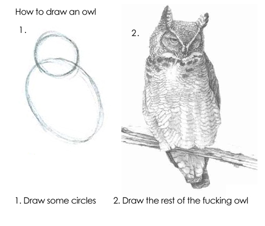

---

Nobel Prize 2024

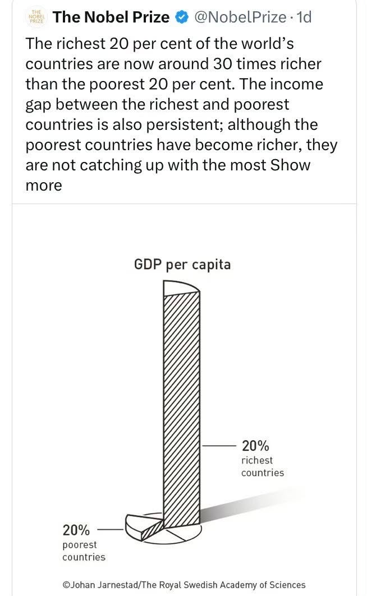{.r-stretch}

---

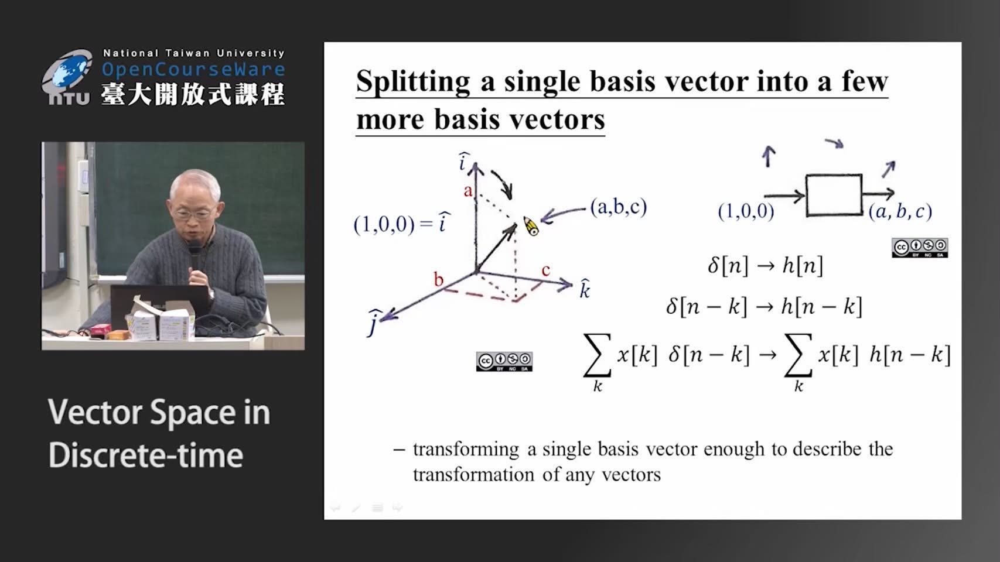{.r-stretch}

---

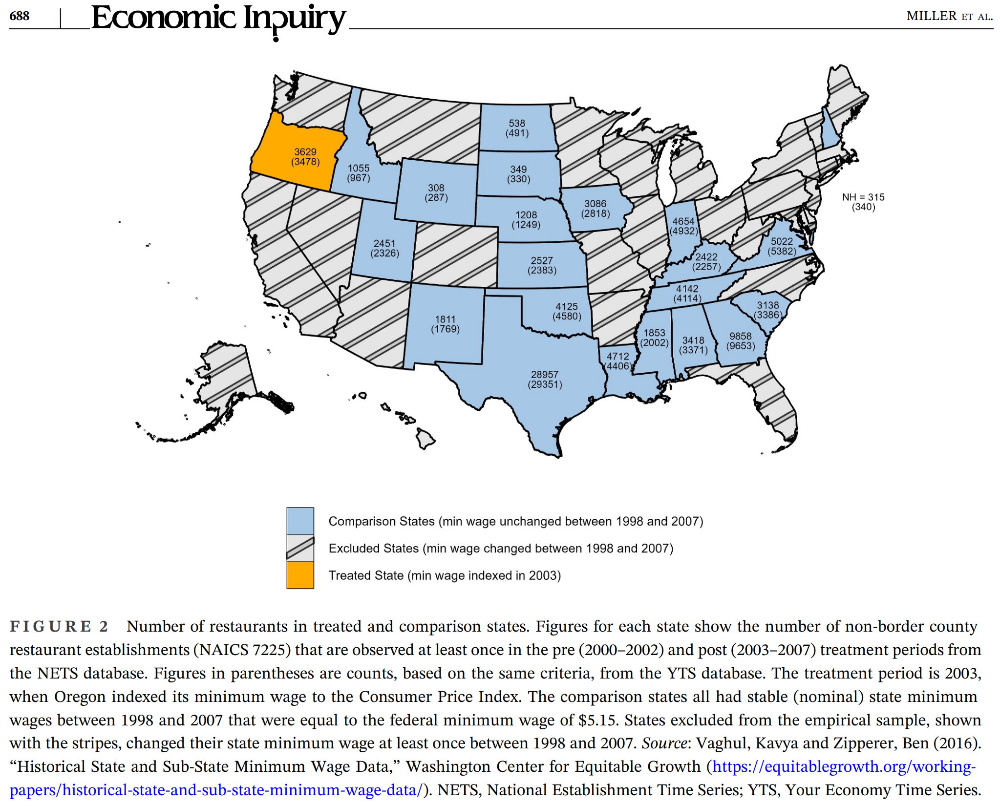{.r-stretch}

# Reading Mindfully

---

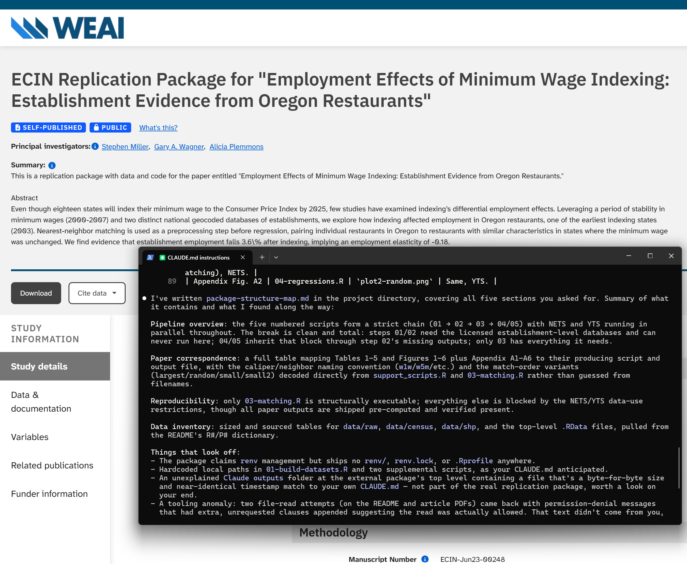{.r-stretch}

## Reading Mindfully (beanEngagingIdeasProfessors2021) {.smaller}

Make sense of what you are assigned to read and why

::: {.incremental}
- Reading rhetorically: Who is the intended audience? What is the author's purpose? What is the exigency that caused the author to put pen to paper or fingers to keyboard? What change in the reader does the author hope to bring about?
- Reading metacognitively: Are we reading a text primarily for information or for interactive engagement with the text's ideas and rhetorical strategies? How does a text affect us emotionally as well as intellectually? How do we connect the text to our own lives or to a network of other texts? What strategies do we adopt when a text becomes confusing or complex?
:::

## Reading for the Conversation

Exercise:

## Discussion

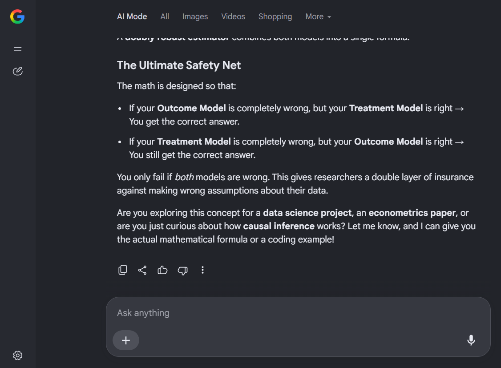{.r-stretch}

What do you do when you don't understand something?

## Discussion

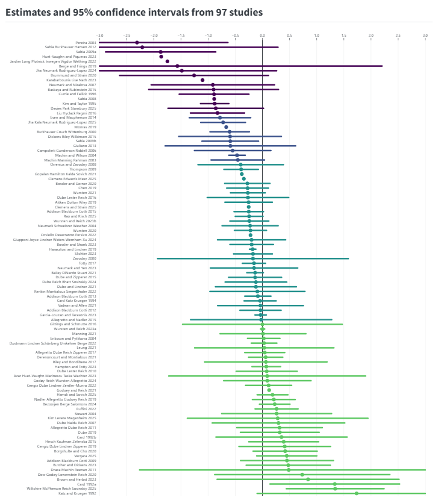{.r-stretch}

::: {.callout-note appearance="simple" icon=false}
Arindrajit Dube and Ben Zipperer. 2025. Minimum wage own-wage elasticity repository, Version 2025.9.1. [https://economic.github.io/owe](https://economic.github.io/owe/)
:::

#  Background

## Modern empirical paradigm: Causality

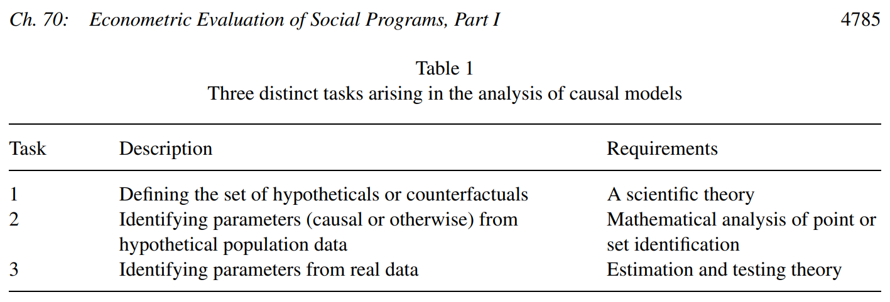{.r-stretch}

::: aside
Heckman and Vytlacil (Handbook of Econometrics 6B, 2007)
:::
